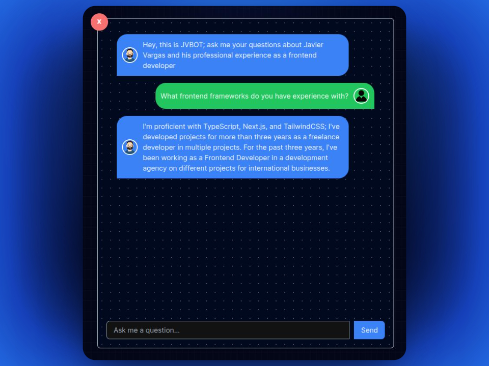

# Personal AI Chatbot - JavierD

Live site: [JVBOT](https://jvbot.vercel.app/)

## Project Overview

This AI-powered chatbot is created to offer potential clients and collaborators an interactive experience, helping users understand my expertise as a frontend developer. Whether it's answering questions about my skills, past projects, or the technologies I use, this chatbot provides responses to support informed engagement. This chatbot was built with a text classifier model from [CoHere](https://cohere.com/).

## Features

- **Personalized Responses**: Answers questions about my background, frontend development experience, and contact information.
- **24/7 Availability**: Accessible at any time, so users can reach out whenever it's convenient.
- **Tech-Focused**: Provides insights into the technologies I work with, like Next.js, Tailwind CSS, and more.
- **Multilingual**: Answers your questions in English and Spanish.

## Example questions:

> _"What frontend frameworks are you proficient in?"_

> _"What is your contact information?"_

> _"Tell me about your english level."_

## Technologies

- **Frontend**: Next.js, Tailwind CSS
- **AI**: CoHere API

## Screenshots

### General chat:

### Language selection:

